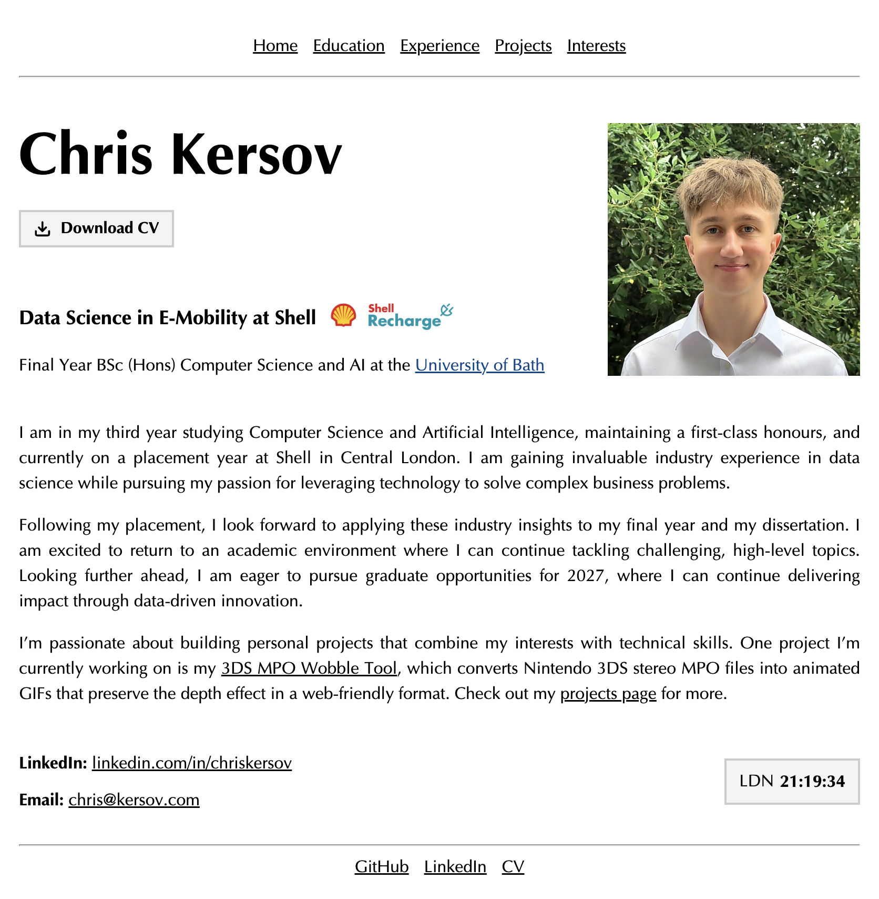

## Personal Website

A minimal, personal website for myself.

### Motivation

This site is a simple place to share my background, interests, projects, and experience in one clean, easy-to-navigate space. I wanted something lightweight, personal, and easy to maintain.

### Preview



### Overview

- Built with [Hugo](https://gohugo.io/)
- Uses the [hugo-xmin](mysite/themes/hugo-xmin) theme
- Deployed via GitHub Actions
- Live site: https://kersov.com

### Sections

- Home
- Education
- Experience
- Projects
- Interests
- CV

### Local development

```bash
cd mysite
hugo server --ignoreCache
```

### Deployment

- Production builds are published from the `mysite/public` directory.
- The site is configured for GitHub Pages with a custom domain.

### Project structure

- `mysite/content/` — page content
- `mysite/layouts/` — custom templates and partials
- `mysite/static/` — static assets
- `mysite/public/` — generated site output

### Notes

This site is intentionally kept clean and lightweight, with content-first pages and minimal styling.
